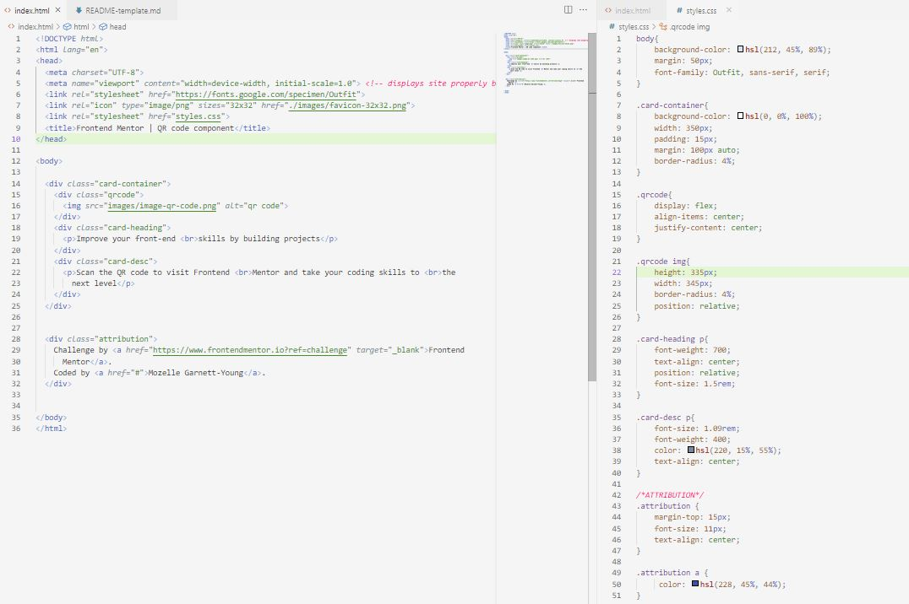

# Frontend Mentor - QR code component solution

This is a solution to the [QR code component challenge on Frontend Mentor](https://www.frontendmentor.io/challenges/qr-code-component-iux_sIO_H). Frontend Mentor challenges help you improve your coding skills by building realistic projects. 

## Table of contents

- [Overview](#overview)
  - [Screenshot](#screenshot)
  - [Links](#links)
- [My process](#my-process)
  - [Built with](#built-with)
  - [What I learned](#what-i-learned)
  - [Continued development](#continued-development)
  - [Useful resources](#useful-resources)
- [Author](#author)
- [Acknowledgments](#acknowledgments)


## Overview

### Screenshot




### Links

- Live Site URL: [Add live site URL here](https://your-live-site-url.com)

## My process
First - How many divs did I need and what are the parent divs/containers
2nd - Add the given css styles
3rd- Align items relative to their parent div/container. Play around with the width and height of the QR code + border radius
4th- Play around to find the right margins and paddings

### Built with

- Semantic HTML5 markup
- CSS3


### What I learned

Aligning a div to the center of a page. 

```css
.qrcode {
   display: flex;
    align-items: center;
    justify-content: center; 
}
```


### Continued development

Centering divs relative to the parent container or to the web page

### Useful resources

Stack overflow. Always ask questions

## Author
- Github - (https://github.com/codes-elle)
- Frontend Mentor - [@codes-elle](https://www.frontendmentor.io/profile/codes-elle)
- LinkedIn - (https://www.linkedin.com/in/mozellegy/)


